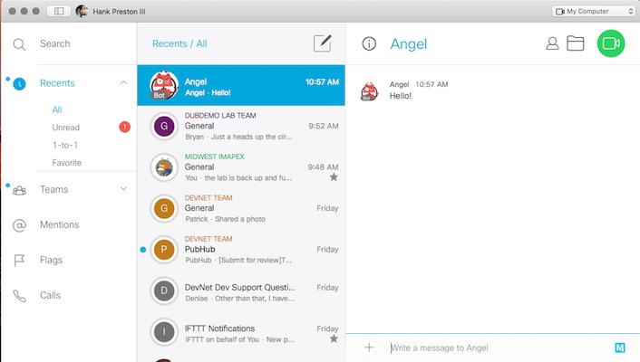

# ToDo

* Windows info
* Link for Kevin's Lab on Workstation Setup
* Prep for possiblity of DevNet Sandbox being down 

[item]: # (slide)


### Brought to you by [imapex.io](http://imapex.io)

[item]: # (/slide)

[item]: # (slide)

# Build a Spark Bot

Quickly get started with a functional Spark Bot, disect it's key components, and add cool new features.  


[item]: # (/slide)

[item]: # (slide)

# Pre-Reqs

* [Cisco Spark Account](http://ciscospark.com)
* [GitHub Account](https://github.com)
* [Docker Hub Account](https://hub.docker.com)
* Basic Workstation/Laptop Prep - **Link to Lab**

[item]: # (/slide)

[item]: # (slide)

## Cisco Spark Account

* [Cisco Spark](https://web.ciscospark.com)


[item]: # (/slide)

[item]: # (slide)

## GitHub Account

* [GitHub Account](https://github.com)


**Suggestion: Match your GitHub and Docker Hub Names (including case)**

[item]: # (/slide)

[item]: # (slide)

## Docker Hub Account

* [Docker Hub](https://hub.docker.com)


**Suggestion: Match your GitHub and Docker Hub Names (including case)**

[item]: # (/slide)


[item]: # (slide)

## Basic Workstation/Laptop Prep

* Lab requires a Mac or Linux Environment
* Windows users can run the lab within a VM or Container ## ToDo - Add Windows info

### Alternative... 

* The lab works best within a Mac or Linux Environment
* Options for Windows users 
    * Run the lab completely from within a Linux VM that has the required tools installed
    * Run natively as long as the following is met in addition to the standard pre-reqs
        * Access to a Windows bash shell


[item]: # (/slide)

[item]: # (slide)

### Must have installed
* `git` command line tools - [Install Instructions](https://git-scm.com/book/en/v2/Getting-Started-Installing-Git)
* `docker` daemon (Natively or *Docker for X*) - [Install Instructions](https://www.docker.com/products/overview)
* An IDE or Text Editor - [PyCharm Community Great Option](https://www.jetbrains.com/pycharm/download/) - **(not Notepad or TextEdit)**

[item]: # (/slide)


[item]: # (slide)

## Windows Users: Running in Sample Container

If your workstation is Windows based, you can run the lab exercises from within a Docker container.  

***You could also run within a Linux Virtual Machine that has the required tools installed and working.  If you choose to use that method, you will need to have a VM already available and ready to use.***

[item]: # (/slide)

[item]: # (slide)

From your Docker host, run the following command to pull down and enter an interactive shell on the provided development container.

```
# It may take some time to complete this command while the full container is downloaded
docker run -it --name botlab -v /var/run/docker.sock:/var/run/docker.sock hpreston/devbox:latest

[root@cf95a414877e coding]#

```

[item]: # (/slide)

[item]: # (slide)

## Container Details 

Linux based working environment with the following utilities and software installed and ready to use.

* nano - Text Editor/IDE for Lab
* git
* docker

[item]: # (/slide)

[item]: # (slide)

[item]: # (slide)

## Restarting Stopped Container 

If you exit out of the container before completing the lab and want to continue from where you left off, do not execute a `docker run` command again.  This will create a new clean container that lacks any of your work.  Instead follow the below to start the original container.

```
# Verify that you have  a container in a stopped state
docker ps -a

CONTAINER ID        IMAGE                         COMMAND             CREATED             STATUS                        PORTS               NAMES
cf95a414877e        hpreston/devbox:latest        "/bin/bash"         2 minutes ago       Exited (0) 10 seconds ago                         botlab

# Restart your stopped container
docker start -i botlab

[root@cf95a414877e coding]#
```

[item]: # (/slide)


[item]: # (slide)

## Lab Phases 

* Deploy the Spark Bot Boilerplate (30 min)
* Disect the key elements of the Bot (40 min)
* Add a cool new feature (20 min)

[item]: # (/slide)

[item]: # (slide)

# Phase 1: Deploy the Spark Bot

1. Create a Bot Account in Spark
1. Setup bot code repository based on boilerplate
1. Build and Push initial Docker Image
1. Deploy your Bot
1. Test your Bot

[item]: # (/slide)

[item]: # (slide)

## Create Bot Account in Spark

A feature within Cisco Spark, is the ability to create *Bot* apps within an account.  Bots work nearly the same as full accounts with only a few differences.  Check this [page](https://developer.ciscospark.com/bots.html) for details. 

* Log into [developer.ciscospark.com](https://developer.ciscospark.com) with your own personal Spark account.  

[item]: # (/slide)

[item]: # (slide)

* Click on **My Apps** in the top menu


[item]: # (/slide)

[item]: # (slide)

* Create a new **Bot** (do not create a new integration)


	
[item]: # (/slide)

[item]: # (slide)

* **Bot Username** needs to be unique within Spark, and can **NOT** be changed


**Sample Bot Image: [http://imapex.io/images/bot-avatar.jpg](http://imapex.io/images/bot-avatar.jpg)**
	
[item]: # (/slide)

[item]: # (slide)

* Record the *Access token* that is displayed on the next page, and **Save Changes**.  If you do NOT copy the token, you can regenerate it.  
* Also note the **Bot Username** that is displayed.  This is the ***Bot Email*** that will be needed when setting up your boilerplate code.  

[item]: # (/slide)

[item]: # (slide)


[item]: # (/slide)

[item]: # (slide)

## Setup Bot Code Repository

We will leverage [github.com/imapex/boilerplate_sparkbot](https://github.com/imapex/boilerplate_sparkbot) as a starting point for our bot.  It was created to make it simple to get started with Bots by providing the needed foundation for a functioning bot and allow the developer to focus on new features.  

[item]: # (/slide)

[item]: # (slide)

* Download the setup script

```
# move to the directory where you store code for your projects
# DO NOT create a folder for your new bot
cd ~/coding 

# Download the script 
curl -OL https://github.com/imapex/boilerplate_sparkbot/raw/master/setup_and_install/new_bot_setup.sh

# Make the script executable 
chmod +x new_bot_setup.sh 
```

[item]: # (/slide)

[item]: # (slide)

###  The script will... 

* Download the boilerplate_sparkbot code
* Create a new local directory for your bot with the boilerplate code
* Delete the downloaded boilerplate code
* Create a new GitHub Repo on your account for the bot 
* Push up the boilerplate code to GitHub
 
[item]: # (/slide)

[item]: # (slide)

### Be Ready to provide... 

* Your GitHub Credentials
* A name for your new Spark Bot 
	* This will be used as the GitHub Repo Name
	* You'll want to use this same name for the Docker Repository you create later
	* Use no special characters, begin with a letter

[item]: # (/slide)

[item]: # (slide)

### NOTE regarding GitHub 2 Factor Auth

* If you have 2FA enabled on your GitHub account, you will need to provide a *Personal Access Token* when prompted for your password
* Tokens can be generated at [github.com/settings/tokens](https://github.com/settings/tokens)
* The token must have a minimum of `repo` access, and `delete_repo` access to automate the creation and cleanup of your new bot

[item]: # (/slide)

[item]: # (slide)

* Run the `new_bot_setup.sh` script

```
./new_bot_setup.sh
```

[item]: # (/slide)

[item]: # (slide)

## Build and Push Initial Docker Image

Our bot will be packaged and delivered as a Docker Image to provide ease of portability, dependency isolation, and simple updates and refreshes.  

[item]: # (/slide)

[item]: # (slide)

* You will need to have logged into Docker Hub on your workstation for this step.  If you haven't done so, you can by running: 

```
docker login 
```

[item]: # (/slide)

[item]: # (slide)

* Build the base bot

```
# Set a couple environment variables to make commands easier
# Replace the <NAME> with your data
export BOT_REPO=<GITHUB REPO>
export BOT_NAME=<YOUR BOT NAME>
export DOCKER_USER=<DOCKER HUB USERNAME>
    
# If you aren't in your new Git Repository directory, change into it 
cd $BOT_REPO
    
# Build a Docker image
docker build -t $DOCKER_USER/$BOT_REPO:latest .
```

[item]: # (/slide)

[item]: # (slide)

* Push the image to Docker Hub

```
docker push $DOCKER_USER/$BOT_REPO:latest
```

[item]: # (/slide)

[item]: # (slide)

## Deploy your Bot

These steps will deploy your bot to the Cisco DevNet Mantl Sandbox.  This is just one option that is freely available to use, however you can deploy your bot to any infrastructure that meets these requirements:

* Able to run a Docker Container
* Provides a URL for inbound access to running containers from the Internet
    * *Spark needs to be able to reach it with WebHooks*

[item]: # (/slide)

[item]: # (slide)

* Deploy your Bot.  
    
```
# From the root of your project... 
cd setup_and_install 
	
# Run the install script
./bot_install_sandbox.sh 
```
    
* Answer the questions asked

[item]: # (/slide)

[item]: # (slide)

* When complete, you should see a message that looks like this

```
Your bot is deployed to 

http://<DOCKER USERNAME>-<BOT NAME>.app.mantldevnetsandbox.com/
    
You should be able to send a message to yourself from the bot by using this call
    
curl http://<DOCKER USERNAME>-<BOT NAME>.app.mantldevnetsandbox.com/hello/<YOUR EMAIL ADDRESS>
    
You can also watch the progress from the GUI at: 
    
https://mantlsandbox.cisco.com/marathon
``` 

[item]: # (/slide)

[item]: # (slide)

## Test your Bot

Your Bot should now be running, let's verify it is up and working.  

[item]: # (/slide)

[item]: # (slide)

* Test that your bot is working by executing the `curl` command shown in your output.  If successfully deployed, you will recieve a message in Spark from your bot.   

```
curl http://<DOCKER USERNAME>-<BOT NAME>.app.mantldevnetsandbox.com/hello/<YOUR EMAIL ADDRESS>
```

[item]: # (/slide)

[item]: # (slide)

### Example Message


[item]: # (/slide)

[item]: # (slide)

* Reply back to your bot and verify that the default commands are working.  
    * `/help` - should return a help message 
    * `/echo Spark Bots are Awesome!` - should reply back with `Spark Bots are Awesome!`

[item]: # (/slide)

[item]: # (slide)

### Example Test Messages


[item]: # (/slide)


[item]: # (slide)

# Phase 2: Disect the Bot

1. Webhooks
1. Leveraging Cisco Spark in Code
1. Building a REST API
1. Command Processing
1. Deploying and Running


[item]: # (/slide)

[item]: # (slide)

## How human's chat


[item]: # (/slide)

[item]: # (slide)

## Bots... simulating a human in code


[item]: # (/slide)

[item]: # (slide)

## Notification for Humans


[item]: # (/slide)

[item]: # (slide)

## Webhooks - Notifications for Bots

```
> HTTP POST 

{
  "appId": "akdjfankasdf8asdf78asdfasdf", 
  "created": "2016-11-10T02:26:40.770Z", 
  "data": {
    "created": "2016-11-10T02:26:50.528Z", 
    "id": "askdfnaksdflj19198123jaksf", 
    "personEmail": "ophelia@elsinore.com", 
    "personId": "a;ldksfnasdfkj981298adskfj", 
    "roomId": "asdnfkasdf98adsf98afnadfkj1238", 
    "roomType": "direct"
  }, 
  "event": "created", 
  "id": "askndfkasd98asd9f8adf", 
  "name": "Calendar Bot", 
  "resource": "messages", 
  "targetUrl": "http://calendarbot.elsinore.not/incoming"
}
```

[item]: # (/slide)

[item]: # (slide)

## Spark WebHooks

Webhooks allow your app to be notified via HTTP when a specific event occurs on Spark. For example, your app can register a webhook to be notified when a new message is posted into a specific room.  


[item]: # (/slide)

[item]: # (slide)

## Leveraging Cisco Spark in Code

Though we could call the REST APIs for Spark directly with Python, [ciscosparkapi](https://github.com/CiscoDevNet/ciscosparkapi) is a "Simple, lightweight, scalable Python API wrapper for the Cisco Spark APIs".  

### Example
```
from ciscosparkapi import CiscoSparkAPI

api = CiscoSparkAPI()

message = api.messages.create('<room_id>', text='<message_text>')

print("New message created, with ID:", message.id)
print(message.text)
```

[item]: # (/slide)

[item]: # (slide)

## bot.py Manages WebHooks Automatically

```
# Function to Setup the WebHook for the bot
def setup_webhook(name, targeturl):
    # Get a list of current webhooks
    webhooks = spark.webhooks.list()

    # Look for a Webhook for this bot_name
    try:
        for h in webhooks:  # Efficiently iterates through returned objects
            if h.name == name:
                sys.stderr.write("Found existing webhook.  Updating it.\n")
                wh = spark.webhooks.update(webhookId=h.id, 
                                           name=name, 
                                           targetUrl=targeturl)
                # Stop searching
                break
        # If there wasn't a Webhook found
        if wh is None:
            sys.stderr.write("Creating new webhook.\n")
            wh = spark.webhooks.create(name=name, 
                                       targetUrl=targeturl, 
                                       resource="messages", 
                                       event="created")
    except:
        sys.stderr.write("Creating new webhook.\n")
        wh = spark.webhooks.create(name=name, 
                                   targetUrl=targeturl, 
                                   resource="messages", 
                                   event="created")

    return wh
```

[item]: # (/slide)


[item]: # (slide)

## Building a REST API

Webhooks are sent as an HTTP POST.  To receive it, your bot needs to provide a REST API.  Every modern programming language supports the creation of a REST API.  

[item]: # (/slide)

[item]: # (slide)

## Flask

The boilerplate code uses the Flask module as the API application.  Flask is a common and easy to use microframework for creating APIs in Python.  

```
from flask import Flask
app = Flask(__name__)

@app.route("/")
def hello():
    return "Hello World!"

if __name__ == "__main__":
    app.run()
```

**More Info: [flask.pocoo.org](http://flask.pocoo.org)**

[item]: # (/slide)

[item]: # (slide)

## bot.py: Code for the WebHook

```
# Entry point for Spark Webhooks
@app.route('/', methods=["POST"])
def process_webhook():
    # Check if the Spark connection has been made
    if spark is None:
        sys.stderr.write("Bot not ready.  \n")
        return "Spark Bot not ready.  "

    post_data = request.get_json(force=True)

    # Take the posted data and send to the processing function
    process_incoming_message(post_data)
    return ""
```

[item]: # (/slide)

[item]: # (slide)

## Command Processing

When the bot is notified of an incoming message via the WebHook, the `process_incoming_message()` function retrieves the message and takes appropriate action.  

[item]: # (/slide)

[item]: # (slide)

## bot.py: Taking Action

```
# Function to take action on incoming message
def process_incoming_message(post_data):
    # Determine the Spark Room to send reply to
    room_id = post_data["data"]["roomId"]

    # Get the details about the message that was sent.
    message_id = post_data["data"]["id"]
    message = spark.messages.get(message_id)

    # First make sure not processing a message from the bot
    if message.personEmail in spark.people.me().emails:
        return ""

    # Log details on message
    sys.stderr.write("Message from: " + message.personEmail + "\n")

    # Find the command that was sent, if any
    command = ""
    for c in commands.items():
        if message.text.find(c[0]) != -1:
            command = c[0]
            sys.stderr.write("Found command: " + command + "\n")
            # If a command was found, stop looking for others
            break

    reply = ""
    # Take action based on command
    # If no command found, send help
    if command in ["", "/help"]:
        reply = send_help(post_data)
    elif command in ["/echo"]:
        reply = send_echo(message)

    spark.messages.create(roomId=room_id, markdown=reply)

```

[item]: # (/slide)

[item]: # (slide)

## Bot Application Facts and Requirements

* `bot.py` is a Python Application that must be running for your bot to work
* `bot.py` must provide it's REST API on the Public Internet for Cisco Spark to send WebHooks 
* `bot.py` must be updated and restarted each time a new feature is added

[item]: # (/slide)

[item]: # (slide)

## Bot Design Choices

* Package and deliver `bot.py` as a Docker image
* Publish the Docker image at the public registry [hub.docker.com](http://hub.docker.com)
* Design `bot.py` to be easily deployed to any Cloud Service supporting Docker applications
* Leverage Cisco DevNet Express Sandbox as default deployment target.  (Deployed with Marathon/Mesos)  

**Details [Mantl Sandbox](https://developer.cisco.com/site/mantl/)**

[item]: # (/slide)

[item]: # (slide)

## Bot Dockerfile

```
FROM python:2-alpine
MAINTAINER Hank Preston <hank.preston@gmail.com>
EXPOSE 5000

# Install basic utilities
RUN apk add -U \
        ca-certificates \
  && rm -rf /var/cache/apk/* \
  && pip install --no-cache-dir \
        setuptools \
        wheel

COPY requirements.txt /app/
RUN pip install -r /app/requirements.txt

WORKDIR /app
ADD ./bot /app/bot

CMD [ "python", "bot/bot.py" ]
```

[item]: # (/slide)

[item]: # (slide)

## Reminder: Building and Publishing a Docker image

```
export BOT_REPO=<GITHUB REPO>
export DOCKER_USER=<DOCKER HUB USERNAME>

    
# Build a Docker image
docker build -t $DOCKER_USER/$BOT_REPO:latest .
docker push $DOCKER_USER/$BOT_REPO:latest
```

[item]: # (/slide)

[item]: # (slide)

## Deploying the Bot Application

In a world of "cloud" and "infrastructure as code" applications aren't installed by double clicking **msi** files, or deploying an **OVA**.  Every cloud platform has a format for defining applications that can be easily deployed through API calls.  

[item]: # (/slide)

[item]: # (slide)

## Marathon Application Definition for the Bot

`sample_marathon_app_def.json`

```
{
    "container": {
        "type": "DOCKER",
        "docker": {
            "image": "DOCKERUSER/DOCKERREPO:latest",
            "forcePullImage": true,
            "network": "BRIDGE",
            "portMappings": [{
                "containerPort": 5000,
                "hostPort": 0
            }]
        },
        "forcePullImage": true
    },
    "healthChecks": [
        {
        "protocol": "TCP",
        "portIndex": 0
        },
        {
        "path": "/health",
        "protocol": "HTTP"
      }
    ],
    "id": "/USERNAME/BOTNAME",
    "instances": 1,
    "cpus": 0.1,
    "mem": 16,
    "env": {
        "SPARK_BOT_URL": "http://USERNAME-BOTNAME.APPDOMAIN",
        "SPARK_BOT_APP_NAME": "BOTNAME"
    }
}
```

[item]: # (/slide)

[item]: # (slide)

## Deploying the Application Definition via API

`bot_install_sandbox.sh`

```
# Part of the Install Script
echo "Installing the Bot as  $docker_username/$bot_name"

curl -k -X POST \
    -u $mantl_user:$mantl_password \
    https://$control_address:8080/v2/apps \
    -H "Content-type: application/json" \
    -d @$docker_username-$bot_name-sandbox.json
```

[item]: # (/slide)

[item]: # (slide)

## Verifying Bot Application Installation

* Login to Marathon at [https://mantlsandbox.cisco.com/marathon/](https://mantlsandbox.cisco.com/marathon/)
    * Username/Password: admin/1vtG@lw@y

[item]: # (/slide)

[item]: # (slide)

* Find your running Application.  It will be in a folder matching your Docker Username.  
 


[item]: # (/slide)

[item]: # (slide)

# Phase 3: Add a cool feature!

1. Add the command information 
1. Stub in your code for the feature
1. Update Bot Logic
1. Rebuild and Re-Deploy your Bot!

[item]: # (/slide)

[item]: # (slide)

## What feature to add you ask?

Have an idea, great!  If you need one...  

### Chuck Norris via API


[http://icndb.com](http://icndb.com/)

### Cat Facts Via API

[https://catfacts-api.appspot.com](https://catfacts-api.appspot.com/doc.html)

[item]: # (/slide)

[item]: # (slide)

## Bot Code File

The code for the bot is in the `bot.py` file located in the `bot` directory of the repository.  

```
$ tree
.
├── Dockerfile
├── LICENSE
├── README.md
├── bot
│   ├── bot.py
├── requirements.txt
└── setup_and_install
    ├── bot_install_sandbox.sh
    ├── bot_uninstall_sandbox.sh
    ├── new_bot_cleanup.sh
    ├── new_bot_setup.sh
    └── sample_marathon_app_def.json
```

Open this file in your IDE/text-editor

[item]: # (/slide)

[item]: # (slide)

## Add Command Information

Your bot listens for a specific set of commands to act on.  These are stored in a dictionary called `commands`.

* Add new commands to the command dictionary in bot/bot.py 

```
# The list of commands the bot listens for
# Each key in the dictionary is a command
# The value is the help message sent for the command
commands = {
    "/echo": "Reply back with the same message sent.",
    "/help": "Get help.", 
    "/chuck": "Get a random Chuck Norris Joke."
}
```

**Don't forget to add a comma after the entry for `help`**

[item]: # (/slide)

[item]: # (slide)

## Stub in Code for New Feature

Each command has a corresponding function that is called.  Here is the function for the `/echo` command.  

```
def send_echo(incoming):
    # Get sent message
    message = incoming["text"]
    # Slice first 6 characters to remove command
    message = message[6:]
    return message	
```

* Function **must** return the text of the message to be sent
* Passing the `incoming` data is only required if your command needs it

[item]: # (/slide)

[item]: # (slide)

## Sample Function

```
def chuck_joke():
    # Use urllib to get a random joke
    import urllib2
    
    response = urllib2.urlopen('http://api.icndb.com/jokes/random')
    joke = json.loads(response.read())["value"]["joke"]

    # Return the text of the joke
    return joke
```

[item]: # (/slide)


[item]: # (slide)

## Update Bot Logic

* Update the `if ...elif` section of the `process_incoming_message` function for your new command.  

```
# Some of function removed below
def process_incoming_message(post_data):
    # Take action based on command
    # If no command found, send help
    if command in ["","/help"]:
        reply = send_help(post_data)
    elif command in ["/echo"]:
        reply = send_echo(message)
    elif command in ["/chuck"]: 
        reply = chuck_joke()
	
    send_message_to_room(room_id, reply)	
```

[item]: # (/slide)

[item]: # (slide)

## Rebuild and Push Your Container

Our bot now has a new ability, but only on our laptop.  Now we must create a new Docker Image.

[item]: # (/slide)

[item]: # (slide)

* Build and Push a new Docker Image

```
# If you've opened a new terminal sense setting before
export BOT_REPO=<GITHUB REPO>
export BOT_NAME=<YOUR BOT NAME>
export DOCKER_USER=<DOCKER HUB USERNAME>

    
# Build a Docker image
docker build -t $DOCKER_USER/$BOT_REPO:latest .
docker push $DOCKER_USER/$BOT_REPO:latest
```

[item]: # (/slide)

[item]: # (slide)

## Restart Your Bot Application

We must restart our running bot to pull down and leverage the new container.  

* Login to Marathon at [https://mantlsandbox.cisco.com/marathon/](https://mantlsandbox.cisco.com/marathon/)
    * Username/Password: admin/1vtG@lw@y

[item]: # (/slide)

[item]: # (slide)

* Find your running Application.  It will be in a folder matching your Docker Username.  
 


[item]: # (/slide)

[item]: # (slide)

* Click on your application, and then click **Restart**


[item]: # (/slide)

[item]: # (slide)

* Wait until the new task shows as **Healthy** 

[item]: # (/slide)

[item]: # (slide)

* Cloud applications lack *state*.  This means after restarting you need to reconfigure these details.  
* The Bot application needs the Spark Account information in order to function.  
* Run this command and provide the bot details

```
cd setup_and_install
./bot_config.sh 
```

[item]: # (/slide)

[item]: # (slide)

### Completed Configuration Message
```
Checking if Bot is up
HTTP Status: 200

Bot is up.  Configuring Spark.
Bot Configuration:
{"SPARK_BOT_TOKEN": "REDACTED", "SPARKBOT_APP_NAME": "angelbot", "SPARK_BOT_URL": "http://hpreston-angelbot.app.mantldevnetsandbox.com", "SPARK_BOT_EMAIL": "angelbot@sparkbot.io"}
```

[item]: # (/slide)

[item]: # (slide)

* Test your new command in Spark

### /chuck Examples


[item]: # (/slide)

[item]: # (slide)

## And Done!

**In this lab...**

* You deployed a fully functional Spark Bot
* Learned the key elements that make it work
* Added a completely new feature

[item]: # (/slide)

[item]: # (slide)

# Go add some more features!

[item]: # (/slide)

[item]: # (slide)


### Brought to you by [imapex.io](http://imapex.io)

[item]: # (/slide)
