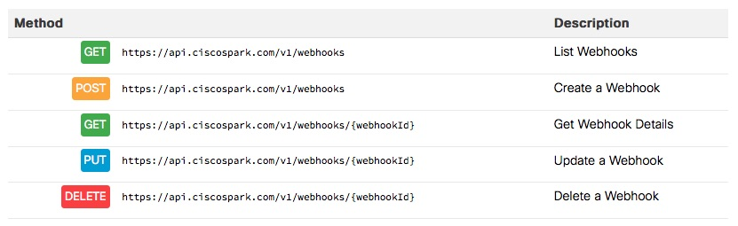

## Spark WebHooks

Webhooks allow your app to be notified via HTTP when a specific event occurs on Spark. For example, your app can register a webhook to be notified when a new message is posted into a specific room.  

